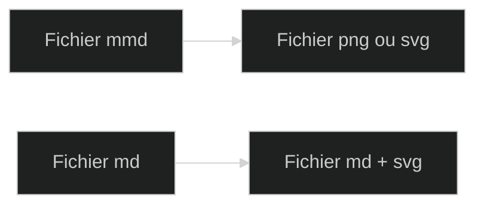
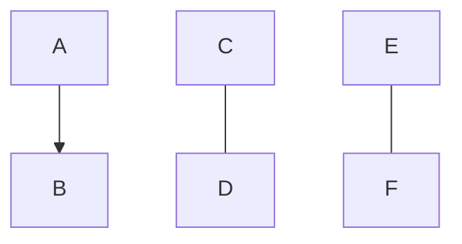
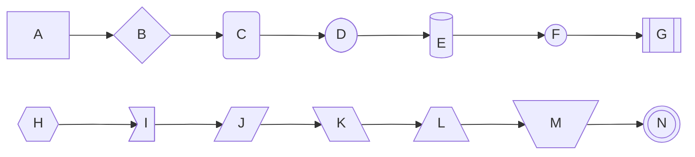
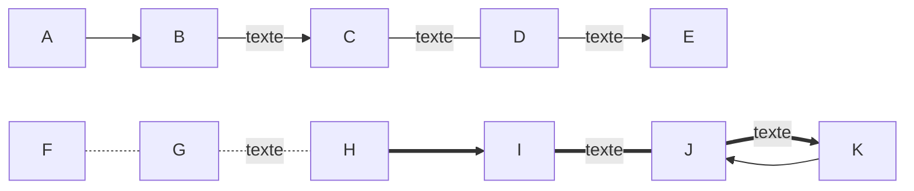
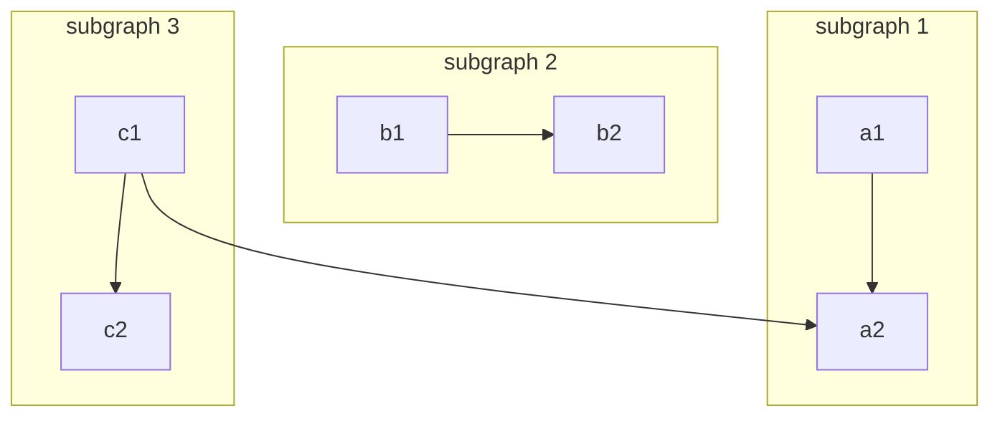
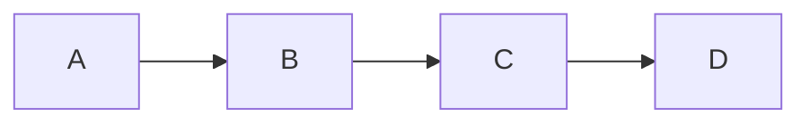

import Picture from "@components/Picture.astro";

import mermaidjsexample1 from "../../assets/images/mermaidjs-example1.png";
import mermaidjsexample2 from "../../assets/images/mermaidjs-example2.png";
import mermaidjsexample3 from "../../assets/images/mermaidjs-example3.png";
import mermaidjsexample4 from "../../assets/images/mermaidjs-example4.png";
import mermaidjsexample5 from "../../assets/images/mermaidjs-example5.png";

Vous en avez marre de créer des schémas d’infrastructures, de processus au format image, mis à jour régulièrement et très chronophage ?

Le code vous parle plus qu’un logiciel de dessin ? Le markdown n’a plus de secrets pour vous ? MermaisJS est fait pour vous !

## Pré-requis

Comme toujours avec un package npm, vous aurez besoin des outils suivants :

- NodeJS
- Un éditeur de code
- Un terminal

Toutes les conditions sont remplies pour démarrer ? Passons à l’installation !

## Installation

La méthode la plus simple pour utiliser MermaidJS est d’aller directement sur leur [
éditeur de diagrammes en ligne](https://mermaid.live/edit), vous pouvez également l’installer sur votre ordinateur, avec, comme souvent, une simple ligne de commande.

Ouvrez un terminal dans le dossier que vous souhaitez, puis exécutez la commande suivante :

```bash
npm install -g @mermaid-js/mermaid-cli
```

La première partie de la commande indique à npm qu’il doit installer un package, la deuxième partie `-g` que l'installation est faite de manière globale et la troisième `@mermaid-js/mermaid-cli` que c'est la CLI de MermaidJS que vous installez.

Si vous souhaitez uniquement intégrer MermaidJS à une page web statique, vous pouvez simplement utiliser le CDN proposé. Si vous copiez ce code dans un fichier html et que vous l’ouvrez avec votre navigateur, vous aurez bien un diagramme et non l’affichage brut du texte contenu dans les balise `<pre class="mermaid">`

```html
<html>
  <body>
    Voici un schéma mermaid :
    <pre class="mermaid">
            graph TD
            A[Client] --> B[Répartisseur de charge]
            B --> C[Serveur 1]
            B --> D[Serveur 2]
    </pre>

    Et un autre :
    <pre class="mermaid">
            graph TD
            A[Client] -->|tcp_123| B
            B(Répartisseur de charge)
            B -->|tcp_456| C[Serveur 1]]
            B -->|tcp_456| D[Serveur 2]
    </pre>

    <script type="module">
      import mermaid from 'https://cdn.jsdelivr.net/npm/mermaid@11/dist/mermaid.esm.min.mjs';
      mermaid.initialize({ startOnLoad: true });
    </script>
  </body>
</html>
```

Si vous souhaitez intégrer des icônes à vos diagrammes, vous pourrez utiliser le CDN de FontAwesome en ajoutant la balise <link></link> suivante à l’intérieur de la balise <head></head> de votre page :

## La syntaxe MermaidJS

MermaidJS a une syntaxe spécifique, qu’il convient de maîtriser afin de réaliser vos diagrammes. En effet, si vous ne la respectez pas à la lettre, vous vous trouverez face à des erreurs sur votre terminal qui empêcheront la génération de vos images.

L’exemple suivant est un fichier MermaidJS, dont l’extension est **.mmd**.

```yaml
---
config:
  look:
  theme:
  fontFamily:
---
type orientation
	contenu
```

L’en-tête du fichier (entre deux lignes de 3 tirets) contient la configuration du diagramme. Plusieurs thèmes sont nativement disponibles avec MermaidJS (”default”, “base”, “dark”, “forest”, “neutral”). On peut également désactiver les thèmes pré-définis avec la valeur “null”. Le look du diagramme peut prendre 2 valeurs, “classic” ou “handDrawn”, autrement dit automatique ou dessiné à la main.

Les orientations possibles sont les suivantes :

- TB - Top to bottom (de haut en bas)
- TD - Top-down (de haut en bas)
- BT - Bottom to top (de bas en haut)
- RL - Right to left
- LR - Left to right

Ce n’est qu’un aperçu des options disponibles, la configuration MermaidJS possédant environ une cinquantaine d’options disponibles que vous pouvez retrouver ici https://mermaid.js.org/config/schema-docs/config.html.

## Générer vos diagrammes

La moitié du travail est faite, il n’y a plus qu’à comprendre comment générer des diagrammes. MermaidJS peut générer l’image d’un diagramme à partir d’un extrait de “code” qu’il va traduire en une image au format svg. La commande qui va réaliser l’opération est la suivante :

```bash
mmdc --input monfichier.md --output monfichier.svg
```

Ici, mmdc est la commande MermaidJS  qui permet de générer les diagrammes. Elle prend 2 arguments :

- `--input` le fichier d'entrée (avec le code des diagrammes) : .mmd ou .md
- `--output` le fichier de sortie (avec le diagramme généré) : .svg (par défaut), .png, .md

Dans le cas du Markdown, on peut noter qu’il n’est pas nécessaire d’utiliser 2 fichiers distincts pour l’entrée et la sortie. Un fichier .md peut être traité par la commande Mermaid mmdc et directement modifié.

Si le fichier d’entrée ressemble à ceci avant de jouer la commande mmdc

```
### Diagramme 1

graph
   [....]

### Diagramme 2

sequenceDiagram
   [....]

```

Après l’exécution de la commande mmdc, il ressemblera à ceci.

```markdown
### Diagramme 1


### Diagramme 2


### Diagramme avec titre et description personnalisés

```

La structure du fichier reste la même, mais les diagrammes ont été remplacés par les images générées par le script.

Vos diagrammes vous paraissent un peu ternes et manquent de couleur ? MermaidJS a pensé à tout !

## Personnaliser vos diagrammes

Je vais ici m’intéresser aux diagrammes de flux. Vous aurez ainsi un aperçu des possibilités de MermaidJS, la logique d’écriture du code étant globalement la même d’un type de diagrammes à un autre.

Si vous souhaitez appliquer des couleurs personnalisées à vos éléments, leurs bordures, votre texte etc. vous pouvez utiliser le thème “base” dont nous avons parlé plus haut. En effet, il est le seul à être modifiable. Avec ce thème, vous pouvez définir les variables de thème que vous souhaitez.

Si on prend un diagramme sans thème personnalisé, on aura ceci :



<Picture image={mermaidjsexample1.png} caption="Diagramme avec le style de base de MermaidJS" />

Si vous souhaitez personnaliser le style de notre diagramme (qu’il s’agisse d’un diagramme de flux ou d’un autre type de diagramme), vous pouvez utiliser le code suivant. Il n’existe qu’un seul thème natif personnalisable, il s’agit du thème “base”.

```mermaid
%%{
  init: {
    'theme': 'base',
    'themeVariables': {
      'primaryColor': '#BB2528',
      'primaryTextColor': '#fff',
      'primaryBorderColor': '#7C0000',
      'lineColor': '#F8B229',
      'secondaryColor': '#006100',
      'tertiaryColor': '#fff',

    }
  }
}%%
---
config:
  look: classic
  fontFamily: sans-serif
---
flowchart LR
  A[Fichier mmd] --> B[Fichier png ou svg]
  C[Fichier md] --> D[Fichier md + svg]
```

Il existe une grande variété de variables de thèmes permettant de personnaliser vos diagrammes, de la couleur d’arrière-plan au style des bordures en passant par les polices d’écriture, bien assez pour vous amuser un moment 😉 !

Chaque type de diagrammes a son lot de themeVariables spécifique, vous ne pourrez pas simplement copier-coller vos styles d’un diagrammes à un autre. La documentation est là pour vous guider (https://mermaid.js.org/config/theming.html), et elle est très bien faite !



<Picture image={mermaidjsexample2} caption="" />


Trop de rectangles tuent les diagrammes, c’est bien connu ! Pourquoi ne pas varier la forme des éléments de vos diagrammes ?




<Picture image={mermaidjsexample3} caption="" />

MermaidJS présente également une grande variété de liens, et les boucles ne posent pas de problème. Les liens peuvent porter du texte, la syntaxe étant légèrement différente.



<Picture image={mermaidjsexample4} caption="" />

On peut également créer des sous-graphes, qui permettent de regrouper visuellement des éléments comme appartenant à une seule entité, à un seul bloc.



<Picture image={mermaidjsexample5} caption="Exemple de schéma avec des sous-graphes." />

On peut également intégrer des liens aux diagrammes MermaidJS.



Pas d'illustration ici, je n'ai pour le moment pas besoin d'intégrer MermaidJS à ce blog.

Je me suis attardé ici sur les diagrammes de flux, mais MermaidJS permet de réaliser des diagrammes d’une vingtaine de types différents dont les plus fréquemment rencontrés sont les suivants :

- séquence
- état
- classes
- Gantt
- camembert
- carte mentale
- timeline
- barre

On retrouve beaucoup de diagrammes directement liés au métier de développeur, mais certains ont un usage beaucoup plus large, comme les camemberts, les timelines et les diagrammes en barres.

## Aller plus loin
MermaidJS peut être utilisé en local via un terminal, mais il existe une grande variété de moyens de l’utiliser autrement :

- le site web
- des plugins :
  - ChatGPT
  - Jira
  - Confluence
  - Visual Studio Code
  - la suite JetBrains
  - la suite Office (Word, Powerpoint)

Et la liste des intégrations ne cesse de s’allonger, puisque sont d’ores et déjà prévues des intégrations pour Google Doc, Notion et Obsidian.

## Sécurité

Afin d’assurer la sécurité de votre site web dans lequel vous avez intégré MermaidJS, on nous permet de régler le degré de sécurisation des diagrammes via un paramètre de configuration nommé securityLevel. Ce paramètre comprend 4 niveaux de sécurité différents :

- strict (par défaut) : les balises html sont encodées mais le clic est désactivé.
- antiscript : les balises html sont autorisées à l’exception des balises script.
- loose : les balises html sont autorisées balises script comprises et le clic est activé.
- sandbox : tout est effectué dans une iframe isolée de la page. Cela empêche l’exécution de JavaScript dans le contexte, notamment les scripts, les popups, les liens etc.

Afin de régler le niveau de sécurité des diagrammes, vous devrez utiliser le script suivant :

```html
<script>
	mermaid.initialize({
	  securityLevel: 'lavaleurchoisie',
	});
</script>
```

## Conclusion

Maintenant que vous connaissez mieux MermaidJS, vous n’avez plus qu’à le tester chez vous, ne vous reste que l’embarras du choix quant à la manière de l’utiliser ! À l’usage, je dirais que le travail avec le terminal est un peu laborieux, nécessite de travailler avec plusieurs fichiers tandis que